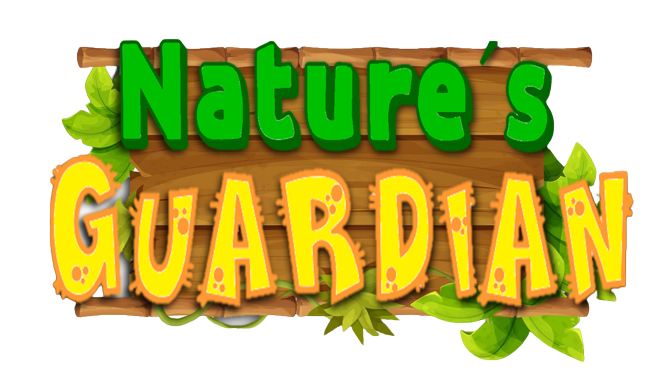
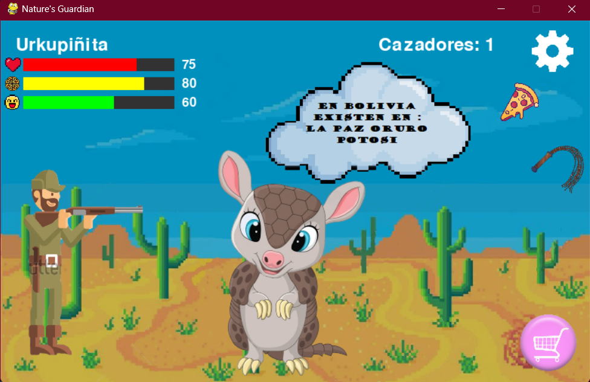

# Natures-Guardian-Juego-Python

## Descripción
Protege a "Urkupiñita" una quirquincho que solo depende de ti para cuidarla de un malvado cazador. Ademas no te olvides de darle cariño y alimentarlo.
Natures Guardian es un juego realizado en python para el Woman Game Jam Bolivia 2023. Este es un juego para consientizar hacer de la vida de los distintos animales en peligro de extinción. Se desarrollo con Python y la libreria Pygame.

## Características
- Jugador Individual.
- Concientizacion.
- Final Inesperado.

## Instrucciones de Uso
1. Ejecuta el Archivo Natures_Guardian.py
2. Empieza a defender a Urkipiñita.
3. Haz que sobreviva el mayor tiempo posible.

## Dependencias
El juego solo nesecita Python 3 con su libreria de Pygame.

## Imagenes

    
    

## Licencia
Este proyecto está bajo la Licencia MIT. Consulta el archivo [LICENSE](LICENSE) para obtener más detalles.

---

¡Diviértete jugando!
